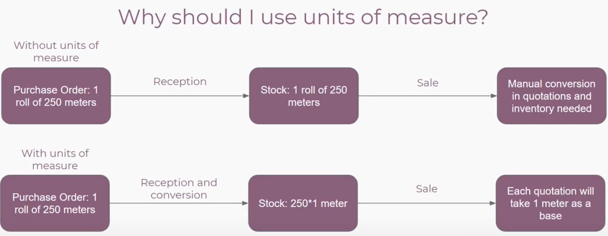
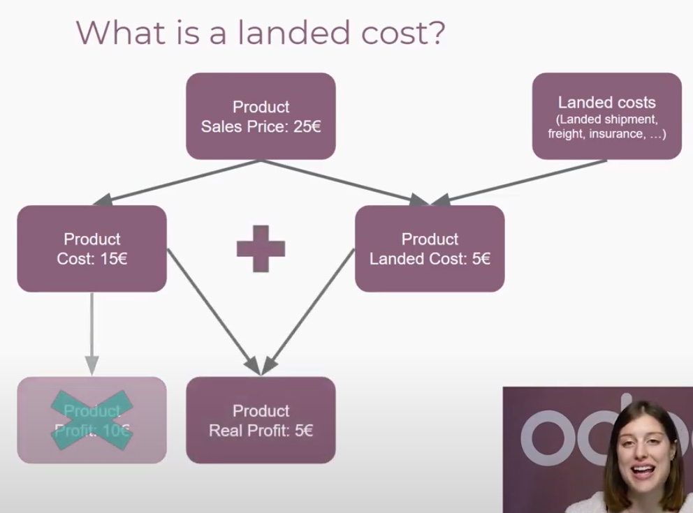

# Odoo Inventory

- https://www.odoo.com/es_ES/slides/inventory-24
## Inventory Adjustment

### Inventory Basics & Warehouse

- Create a Sales Order (new Quotation) set quantity (if you select more than stocked)
- Visit Delivery Smart Button
- If you try to validate you obtain an error
    - "User Error: You cannot validate a transfer if no quantities are reserved nor done. To force the transfer, switch in edit mode and encode the done quantities."
    - Then you need make some Purchases to fill up the inventory.
        - Create new PO and Save & confirm the new purchase order
        - Validate the Receipt with smart button or go Inventory > Overview > Receipts
        - Select the PO and validate (Immediate Transfer? You have not recorded done quantities yet, by clicking on apply Odoo will process all the quantities.)
            - Or select the done quantity before editing the PO
            - It's important to VALIDATE the Warehouse inventory "move IN" after the purchase to update the on hand amount of products
        - Now back to Inventory Overview and select "Delivery Orders -> Waiting"
    - (Press UNRESERVE if you want to set Waiting state from Ready in SO)
    - You can see "Check Availability" Action button
        - If all the on hand products match the original demand of SO then the system set equals Demand and Reserved
        - You MUST record "done" quantities
        - Then "VALIDATE"
    - If you VALIDATE SO without the equals Demand - Reserved - Done quantities
        - CREATE BACKORDER or NO BACKORDER
#### Quizz

1. How can I configure my delivery orders to send in two different deliveries or more when I don't have enough stock?
    - By creating a back order when validating a delivery order (*)
    - By creating a trace back when validating a delivery order
    - By creating a scrap order when validating a delivery order
    - By creating a split order when validating a delivery order
2. What type of document will be the source of a receipt?
    - A sale order
    - An invoice
    - A quotation
    - None of the above. (*)

### Inventory Adjustment Techniques

- Manual adjustement
    - Update quantity
    - Select Location WH /Stock
    - Change the On Hand
    - Go to Product -> Availability
#### Quizz

1. What is the destination of products I remove from my stock by manually adjusting my inventory?
    - WH/Stock/Inventory Adjustments
    - WH/Stock/Virtual Locations
    - Virtual Locations/Inventory Adjustments (*)
    - Virtual Locations/WH/Stock
2. What will be the route of a manually updated product if my warehouse name is WH?
    - WH/Stock -> Virtual Location/Inventory Adjustment
    - WH/Stock --> Virtual Location/WH/Stock
    - Virtual Location/WH/Stock --> WH/Stock
    - Virtual Location/Inventory Adjustment --> WH/Stock (*)

### Units of Measure

- Inventory > Conf. > Settings >  Products > UOM
- Conf. > UOM Categories
- Conf. > UOM

- Smaller than reference -> 1*(ref unit) = ratio*(this unit)
- 1CM Smaller than meter -> 1*(m) = 100*(cm)
#### Quizz

1. At what point in the process will the unit of measure conversion take place?
    - During the reception (*)
    - During the purchase
    - During the sale
    - During the delivery
2. I set up a unit of measure smaller than the reference one, with a ration of 20. If I buy 50, what will the initial demand provided by Odoo be after the conversion?
    - 0.4
    - 25
    - 2.5 (*)
    - 50

### Integrated Landed Costs
- Inventory > Conf. > Settings > Valuation > Landed costs
- Produc categpry > All > Inventory Valuation
    - Costing (AVOC)
    - Inventory Valuation (Automated)
- Create new Product as Service
    - Accounting (tab)
        - Check "Is a Landed Cost"
- Purchase the product
    - Create a Bill for the landind costs (fe: Transportation)
    - Save and Post

#### Quizz

1. If I sell a product for 50€, what will be my profit with a cost of 20€ and a landed cost of 10€?
    - 40€
    - 50€
    - 30€
    - 20€ (*)
2. What product type should I choose for a landed cost?
    - A Service (*)
    - A Consumable
    - A Storable Product

## Track your products

### Using Routes

#### Quizz
1. My warehouse is named "YourCompany", and my delivery strategy is configured as "1-step delivery". Based on that, what will my delivery route's name be (the automatically generated one), for that specific warehouse?
    - Deliver in 1 step: YourCompany
    - YourCompany: Deliver in 1 step (ship) (*)
    - YourCompany: Deliver in 1 step
    - Deliver in 1 step (ship): YourCompany
2. If I select "Product Categories" in my route's settings, will this route be applied to all my products?
    - No, never
    - Only if I add this route to the "all" product category (*)
    - Yes, the product category always takes the priority even if not set up in a specific category

### Push & Pull Rules

#### Quizz
1. Apart from "Take from stock" and "Take from stock, if...", what is the other supply method I can use for my routes?
    - Trigger another rule
    - Take from customer location
    - Take from virtual location
    - Trigger the previous rule
    - No supply
2. To fulfill a customer order, will the system rely on push on pull rules?
    - Pull
    - Push
    - Both

### Managing Lots

#### Quizz

### Managing Serial Numbers

#### Quizz

### Removal Strategies

#### Quizz

### Picking Methods

#### Quizz

### Working with perishable products

#### Quizz