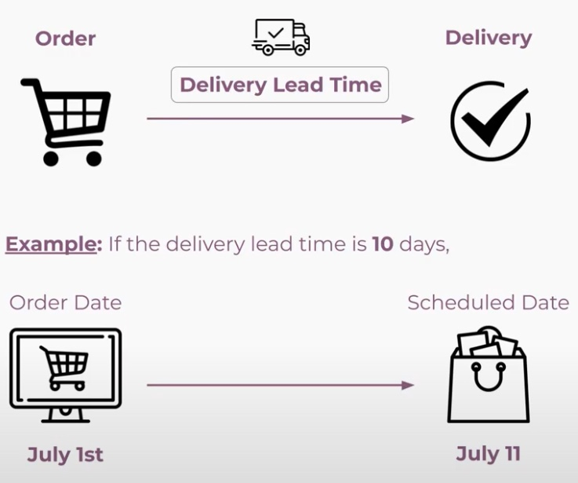
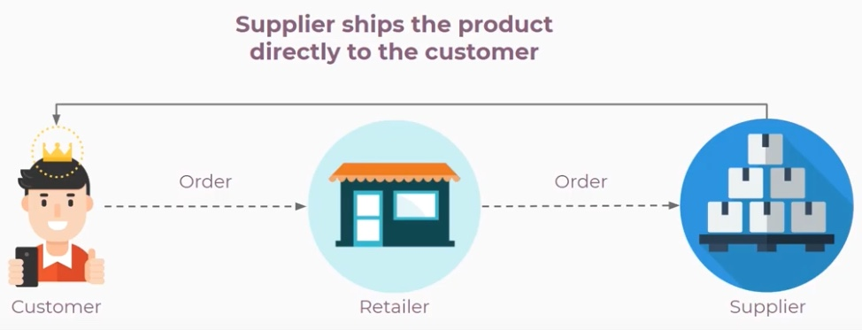
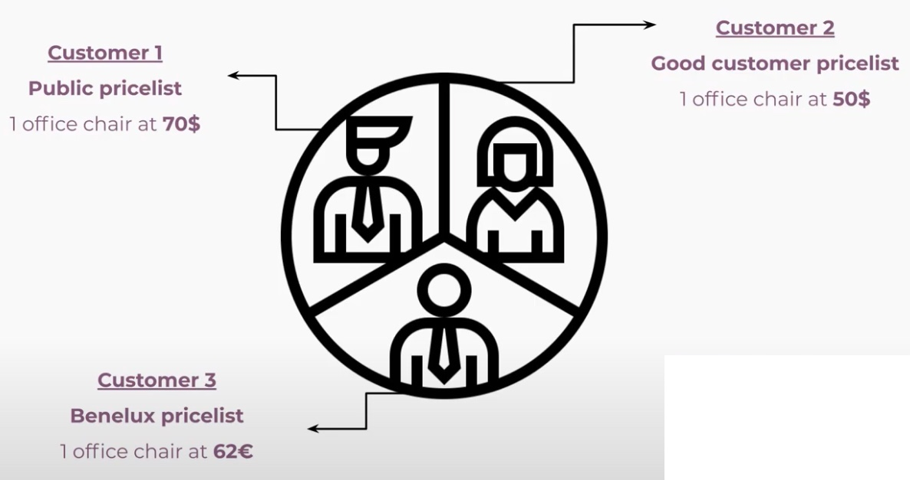
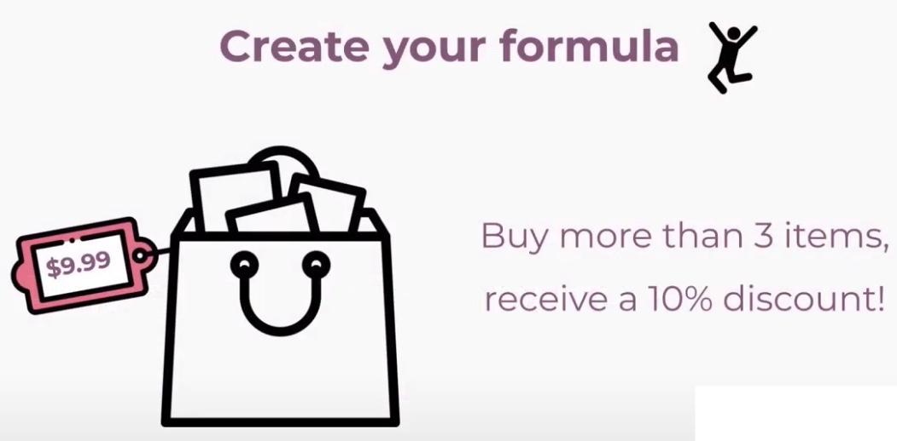

# Odoo Sales

- https://www.odoo.com/es_ES/slides/sales-17

## Quotations

### Sales Basics and Your First Quotation
- create quuotation orders > quotations
- select or autocreate customer
- add products (you can activate product configurator on the settings, for variants fo example) also you can add related products
- in popup product template, sales tab, scroll down to Options, and select "Optional products"
- in the product price cell you can use formula to calculate =9*12
- Can add sections, add title and you can drag and drop in order to manteni organized products
- Can add notes, the same sections
- can print or send by email the quotation to the customer (you can customize the email before send)
- sales orders sent by email can be found in the chatter
- exists too "customer preview"
- When quotation is confirmed -> sale order and delivery order is created

### Product Variants
- sizes, colors
- Sales > Conf. > Settingd > activate variants > attributes (add variants) radio, color, select
- assingn values and related products
- On the product form you can see the variants on smart button variants
- Action to configure variants on the product. Set the price (extra price)
- The values can be imcompatible with some products

#### Quizz
1. Is it possible to set a different price for each variant? Yes/No Yes
2. What are the different attribute types?
    - Radio, Selection, Color
    - Check, Radio, Selection
    - Radio, Select, Color (*)
    - Check, Color, Boolean
    - Boolean, Selection, Color
    - Boolean, Radio, Select
3. If I have two attributes, one with 3 items, the other with 4, how many variants will my product have?
    - 3
    - 4
    - 7
    - 12 (*)
    - 15
    - 17

### Online Quotation
Quotation -> Sale Orders -> Invoices
- You can recommend other products to the customer

- Sales > Conf. > Settings > Quotations & Orders
    - Online signature
    - Online payment
    - Quotation Templates
    - Quotation Builder

- Create Quotation template
    - Put the name
    - Add products
    - Optional products (also can need some other products)
    - Confirmation (online sign and pay)
    - can set expiration date or only for specific company
    - Save then you can design template (on the web site builder)

- Sales > Quotation new
    - Select template
    - send email
    - can preview quotation from smart button
    - the customer can click on the cart icon and set the amount
    - Sign and pay
#### Quizz
1. Does online quotation allow upselling?
    - Yes
    - No (*)
    - Only in the test environment
    - Only in the production environment
2. Can I cross-sell on my online quotations?
    - Yes (*)
    - Only with the eCommerce app installed
    - Only in the production environment
    - No
3. What does the online quotation allow?
    - To sign online
    - To pay online
    - Both (*)

## Delivery
- costs of the ship
- create rules for shipping costs (sizes, deliverers...)

### Delivery Prices
- Sales > Conf. > Settings > Shipping
    - activate Shippings Costs
- Go Shipping methods
    - Create one, with provider and publish (can be assigned to an one company)
    - with fixed price (can be free) for example 10€ (if amount greater than number can be free)
    - specific countries or zip codes
- Go orders & create new order
    - add new product
    - add the shipping (as a product) the price also can be customize
    - if the total is upper than shippping cost rule then update price to 0
- Shipping method based on rules
    - create new
    - Pricing tab. Add conditons line by line (weight, size, price, quantity, volume, etc)
    - Click on "Add shipping" button on the right bottom under the products lits
    - Update shipping cost (button right bottom)

#### Quizz
1. What are the default delivery charges when I add shipping costs?
    - 0 (*)
    - 5
    - 60
    - Odoo doesn't create a default shipping method including delivery charges
2. I want my customer to pay $20 if the weight of the order is over 5kg and $10 if not. What can I do?
    - You can use a shipping method based on rules with two conditions. (*)
    - You can use a shipping method based on rules with one condition.
    - You can create two different shipping methods, each set with its own price and weight.
    - Odoo does it automatically.

### Delivery Lead Times
- https://youtu.be/dSoz37q1tBg
- The during the order is "traveling" to the customer (hours, days or months..)
- 

- Sales
     - Products > Products > Product > Inventory (Tab) > Customer Lead Time
     - Create Sale Order
     - Confirm SO
     - Then Order Date and in the Other Info tab can see Delivery Date (Expected)
     - On the Smart Button "Delivery" you can see the Delivery Order (Stock.Picking model)
     - For more security go Inventory > Config. > Settings > Advanced Scheduling
        - Security LEad Time for Sales

#### Quizz
1. What's the impact of adding 2 days in customer lead time?
    - The customer will have two extra days to validate his quotation
    - Delivery orders will be scheduled 2 days before
    - Delivery orders will be scheduled 2 days later(*)
2. I have a customer lead time of 15 days. What will be the scheduled date for the delivery if the confirmation date is 01/23?
    - 02/07(*)
    - 02/08
    - 02/06
    - 01/08
    - 01/06
    - 01/07

### Dropshipping

- Purchase > Conf. > Settings > Logistics > Dropsipping
- Go to Product > Inventory (Tab) > Enable Routes Dropsiphing
- Add a vendor on the Purchase(tab) > Vendors
- if there are many vendors (the first in list, can be reordered)
- A purchase is automatically generated when the Sale Order is confirmed
#### Quizz
1. Do I need to install the Purchase app to use the Dropshipping feature?
    - No
    - Yes (*)
2. When I confirm a quotation with a dropshipped product, what will be the status of the quotation?
    - Waiting Another Operation
    - Quotation
    - Sales Order (?)
    - Purchase Order
3. What will happen when I receive the product of the dropshipped product in the purchase order?
    - The delivery will automatically be moved to "done".(*)
    - You will have to deliver the product
    - You need to update your stock
4. Where can I activate this Dropshipping feature ?
    - In the settings of the Sales app configuration
    - In the settings of the Purchase app configuration (*)
    - In the general settings
    - All of above
    - None of above
## Pricelists

### Multiple

- Sales > Conf. > Settings > Pricing > Pricelists > Multiple
    - ... > Pricelists or Sales > Products > Pricelists
- Create New Pricelist
    - Specify products and variants
    - Assign Pricelist to each Customer
        - Contacts > Edit > Sales & Purchases (tab) > Pricelist
#### Quizz
1. Can I show the discounts I give to my customers?
    - Yes (*)
    - No
    - Only if you use pricelists on all products
    - Only if you use pricelists on a category of products
2. How can I set up my pricelists so they will be used automatically in quotations?
    - By adding the pricelist to a contact
    - You need to add a price for the pricelist on the product form and reference the pricelist on a contact form (*)
    - You can't do that
    - By adding a price for them on a product form
    - By adding a price for them on the contact form

### Computed

- Based on rules
- Sales > Conf. > Settings > Pricing > Pricelists > Advances price rules

#### Quizz
1. Can I decide to set a minimum quantity to apply a discount based on a pricelist ?
    - Yes (*)
    - No
    - Only with standard pricelists
    - Only when using a pricelist based on weight
2. How can I define a pricelist only for the US?
    - By adding US to the pricelist's limited countries.
    - By adding US to the pricelist's country groups. (*)
    - By adding US to the pricelist's restricted countries.
    - By adding US to the pricelist's promotional code.