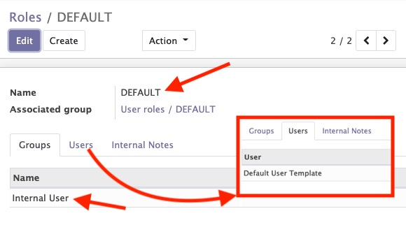
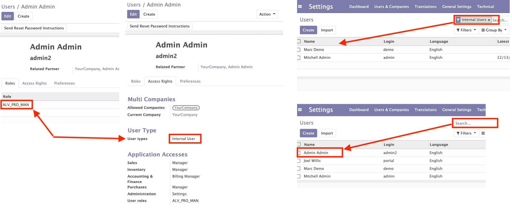

# Odoo Security

## Resources
- https://github.com/Alliantum/odoo_easy_permissions
- https://github.com/OCA/server-backend/tree/12.0/base_user_role
- https://www.youtube.com/watch?v=wgPtgPbY4uc
- https://www.youtube.com/watch?v=5B04XH6jdP8
- https://github.com/OCA/server-backend

## BASE USER ROLES (oca/https://github.com/OCA/server-backend/base_user_role)
- https://github.com/OCA/server-backend/base_user_role

### Considerations
- define functional roles by aggregating low-level groups,
- set user accounts with the predefined roles (roles are cumulative),
- update groups of all relevant user accounts (all at once),
- ensure that user accounts will have the groups defined in their roles
(nothing more, nothing less). In other words, you can not set groups
manually on a user as long as there is roles configured on it,
- activate/deactivate roles depending on the date (useful to plan holidays, etc)
- get a quick overview of roles and the related user accounts.
- To configure this module, you need to go to *Configuration / Users / Roles*,
and create a new role. From there, you can add groups to compose your role,
and then associate users to it.
- Define default roles for a new user by editing the user called
"Default User" (look for "Inactive users").

Consider create Default Role for Default User:


### After install
- IMPORTANT!!! Be careful if you assign admin user to a Role without Groups the user will lost all permissions. It is preferable not to assign roles to the administrator
- After assign Role to a user. User is not shown anymore on users list if it is filtered by "Internal users". bug?


## Groups
- Defined in security folder within a XML file
```xml
<!-- SHOW the Group like a Checkbox-->
<odoo>
    <record id="my_group_id" model="res.groups">
        <field name="name">Group Name</field>
    </record>
</odoo>
```

```xml
<!-- SHOW the Group within a Selector -->
<odoo>
    <record id="module_category_id" model="ir.module.category">
        <field name="name">My Category Name</field>
        <field name="description">Some text explaining the category</field>
        <field name="sequence">10</field>
    </record>
    <record id="my_group_one_id" model="res.groups">
        <field name="name">Group Name One</field>
        <field name="category_id" ref="addon_name.module_category_id"/>
    </record>
    <record id="my_group_two_id" model="res.groups">
        <field name="name">Group Name Two</field>
        <field name="category_id" ref="addon_name.module_category_id"/>
        <field name="implied_ids" eval="[(4, ref('addon_name.my_group_one_id'))]"/>
    </record>
</odoo>
```

## Record Rules
- Related with Groups
- If Groups is empty then is applicable to all the groups (it's like global rule)

## Access Rights
- Related with Groups
- Defined on **ir.model.access.csv** file on security folder
- Defined for each model
```csv
id,name,model_id:id,group_id:id,perm_read,perm_write,perm_create,perm_unlink
access_id,access.name,addon.model_model_name_id,addon.group_id,1,1,1,0
access_id_2,access.name.two,addon.model_model_name_id,,1,0,0,0
```
| id          | name        | model_id:id                   | group_id:id    | perm_read | perm_write | perm_create | perm_unlink |
| ----------- | ----------- | ----------------------------- | -------------- | --------- | ---------- | ----------- | ----------- |
| access_id   | access.name | addon.model_model_name_id     | addon.group_id | 1         | 1          | 1           | 0           |
| access_id_2 | access.name.two | addon.model_model_name_id |                | 1         | 0          | 0           | 0           |

## __manifest.py__
```python
{
    'data': [
        'security/security.xml',
        'security/ir.model.access.csv'
    ]
}
```